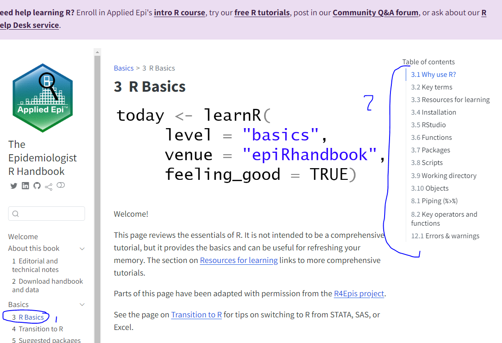

## TLDR

Refer to this online doc for guidance: 

- <https://epirhandbook.com/>

-   <https://r4ds.hadley.nz/data-transform>

## TIMELINE

-   **1:30 PM - 1:50 PM**: rstudio orientation (chapter 3.5), functions
    (3.6), working directory (3.9), packages (3.7), scripting (3.8),
    piping (8.1), key operators and functions (8.2)

    -   rstudio orientation (chapter 3.5)
        -   change console to top right
        -   mention difference between R and Rstudio
    -   functions (3.6)
        -   what are functions, give example of glimpse(iris), import
            csv \[in data folder… *SHOW WORKING DIRECTORY*\]
    -   working directory (3.9)
        -   they will create an R project in local.. I recommend to
            avoid one drive. old school ctrl + s in hard drive.. they
            can save in documents if easier.
    -   packages (3.7)
        -   show install.packages(““), library(), what is
            pacman::p\_load() ?
        -   show how to read library::function() - helps specify the
            function from x library and to avoid conflicts with other
            similar functions from different library. ie similar hammer
            but from different toolset.
        -   base r vs packages
    -   scripting (3.8)
        -   what is scripting, procedural coding. Other R file types.
        -   code syntax! dont write unreadable code guide:
            <https://style.tidyverse.org/syntax.html>
    -   piping (8.1)
        -   show why piping is usefull, show cake example
    -   Key operators and functions (8.2)
        -   use example\_data.csv while teaching this
        -   teach operators
        -   %in% op

-   **1:50 PM - 2:00 PM**: 10 min break time

-   **2:00 PM - 2:30 PM**: exploring a dataset, objects/datatypes
    (3.10),

    -   exploring a dataset
        -   show cars, my dataset, iris, etc
        -   this youtube: <https://www.youtube.com/watch?v=3iz-2iM4RFE>
    -   objects/datatypes (3.10)
        -   show vector, convert datatypes
        -   good link:
            <http://venus.ifca.unican.es/Rintro/dataStruct.html>

-   **2:30 PM - 2:45 PM**: why not excel? Why R? What is the meaning of
    life lol?

    -   why use R instead of excel
        -   version control with git, automate task (show sherri
            vaccination data email), covid mass correction,
            recordlinkage, modeling

-   **2:45 PM - 3:00 PM**: Questions

## Epi Handbook Weird UI

Below will show how to navigate through chapters and table of contents

