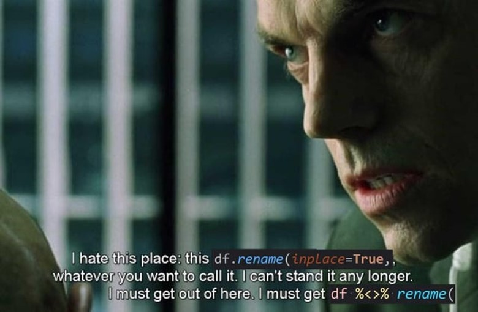

---
output:
  html_document: default
date: "2024-09-23"
---

```{r setup, include=FALSE}
knitr::opts_chunk$set(echo = T)

library(tidyverse)
library(janitor)

# session 1---------------------------------------------------------------------
df_csv <- read.csv(paste0(getwd(), "/example_data.csv")) 

df_csv_formating <- df_csv %>%
  clean_names() %>% 
  rename("ethnicity" = "hispanic", "exercise" = "excerise") %>%
  select(dob, ethnicity, race, sex, zip_code, insurance, exercise, max_squat, everything())
# session 1---------------------------------------------------------------------


# session 3---------------------------------------------------------------------
df_clean_race_strength <- df_csv_formating %>%
  mutate(
    lower_case_race = tolower(race),
    edit_race = case_when(
      lower_case_race == "caucasian" ~ "white",
      lower_case_race == "am-af" ~ "black",
      TRUE ~ lower_case_race
    ),
    race = edit_race,
    avg_strength = round(rowMeans(select(., max_squat, max_bench ,max_deadlift)))
  ) %>% 
  select(-c("lower_case_race", "edit_race")) 

vec_race <- c("white","black", "asian", "mixed", "other") %>% sort() 

# if (identical(sort(unique(df_clean_race_strength$race)), vec_race) == TRUE){
#   insight::print_color("PASS: vectors match", "green")
# } else {
#   insight::print_color("!!FAIL: vectors NO match!!", "red")
# }

# average strengh of contestants
mean_strenth_overall <- sum(df_clean_race_strength[,8:10]) / nrow(df_clean_race_strength) # nrow 
# session 3---------------------------------------------------------------------
```


## **SESSION 3**: [column calculation/manipulation]

For this training session we will go over the case_when(), rowSum() and best practice when manipulating columns.

The code below is from session 1. We are standarizing the columns with janitor::clean_names() and renaming the columns.

### **session 1 code**
```{r results = "hide"}
# import data
df_csv <- read.csv(paste0(getwd(), "/example_data.csv")) 

# standarize col names
df_csv_clean_names <- df_csv %>% clean_names()

# rename col names
df_csv_new_column_names <- df_csv_clean_names %>% 
  rename("ethnicity" = "hispanic", "exercise" = "excerise")

# reorder col names
df_csv_select <- df_csv_new_column_names %>% 
  select(dob, ethnicity, race, sex, zip_code, insurance, exercise, everything())

# rename object for clarity
df_csv_formating <- df_csv_select
```


### **session 1 code altnerative w/ pipe operator**
This is the same output as above, just a different way in writing it. Note how the pipe operator condenses the code so we do not have to initialized a new dataframe object after every manipulation to x dataframe... im looking at you python.

{width=5in}
```{r results = "hide"}
df_csv <- read.csv(paste0(getwd(), "/example_data.csv")) 

df_csv_formating <- df_csv %>%
  clean_names() %>% 
  rename("ethnicity" = "hispanic", "exercise" = "excerise") %>%
  select(dob, ethnicity, race, sex, zip_code, insurance, exercise, max_squat, everything())
```


### **session 3 code**
Now we will move to manipulating columns. For now lets clean the race column using the case_when(), remember to standarize the race column by converting into lower case so you dont have to write more conditions in the case_when(). 

note: there are many ways to standarize dataset so if you have an idea on how to manipulate but you do not know how.... search it up on google! Generally your question has been asked and answer previously. Asking the right question is 90% coding... then 10% reading documention if youre cooked... jk documentation is great too.
```{r results = "hide"}
df_clean_race_strength <- df_csv_formating %>%
  mutate(
    lower_case_race = tolower(race),
    edit_race = case_when(
      lower_case_race == "caucasian" ~ "white",
      lower_case_race == "am-af" ~ "black",
      TRUE ~ lower_case_race
    ),
    race = edit_race,
    avg_strength = round(rowMeans(select(., max_squat, max_bench ,max_deadlift)))
  ) %>% 
  select(-c("lower_case_race", "edit_race")) 

vec_race <- c("white","black", "asian", "mixed", "other") %>% sort() 

# if (identical(sort(unique(df_clean_race_strength$race)), vec_race) == TRUE){
#   insight::print_color("PASS: vectors match", "green")
# } else {
#   insight::print_color("!!FAIL: vectors NO match!!", "red")
# }

# average strengh of contestants
mean_strenth_overall <- sum(df_clean_race_strength[,8:10]) / nrow(df_clean_race_strength) # nrow 
```
